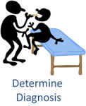

# Common Care Pathway

  

<!-- 
Diagram evokes more encounter-based care, doesn't communicate that it potentially applies to more distributed care

Potentially simplify even more:
  Diagnosis/Therapy/Procedure/Identity
-->

## Registration

  

Identifying and recording the subject of care.

## Triage

  

Performing basic triage to identify any signs that emergency care is required

## Local Urgent Care

  

Providing local urgent care based on the outcome of a triage process.

## History and Physical

  

Gathering clinical history and performing and recording observations regarding the patient's health (e.g. blood pressure, temperature, etc.).

## Provide Counseling

  

Informing the subject of care about their treatment options and about how their ongoing care should be managed between visits. This is also where treatment constents are obtained and where health education is provided.

## Diagnostic Testing

  

Conducting diagnostic tests, including lab tests, collection of samples, and other diagnostic tests. Lab testing may be done locally (e.g. HIV quick test) or the samples may require lab order fulfillment workflow.

## Determine Diagnosis

  

Using available information from the patient's history, current examinations, tests, and assessments to assist in developing a diagnosis.

## Guideline-based Care

  

Performing and recording observations, interventions, and treatments plans recommended by specific guidelines.

## Dispense Medications

  

Administering medications, ordered by clinicians and dispensed by a pharmacy. Pharmacies may be local to the care facility or community-based, and involves supply chain transactions to support medication management.

## Emergency Care

  

Providing emergency care in trauma cases or as part of guildeline-based care escalation.

## Acute/Tertiary Care

  

Providing acute or tertiary care, either as an escalation from emergency care, or from primary care due to guideline-based referral patterns.

## Charge for Service

  

Charging for services rendered, regardless of the mechanism of coverage.

## Discharge/Referral of Patient

  

Discharging or referring a patient, including the movement of patients through levels of care delivery (e.g. acute to primary, primary to community, etc.) or the enrollment of patients in guideline-based care programs (e.g. HIV, maternal, diabetes, injury rehabilitiation, etc.).

## Record and Report

  

Recording and reporting patient-specific care management information which may be aggregated to develop reportable system management indicators at the priovider, facility, district, national, and international levels.

## Monitor and Follow-up of Patient

  

Monitoring and tracking progress for each patient based on guideline recommendations.

## Alerts Reminders Education

  

Providing alerts, reminders, and education to patients, providers, and health system managers.

