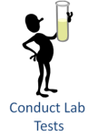
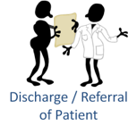

# Common Care Pathway

// Diagram evokes more encounter-based care, doesn't communicate that it potentially applies to more distributed care

// Potentially simplify even more:
// Diagnosis/Therapy/Procedure/Identity

## Record ID Information

Identifying and recording the subject of care.

// Possibly registration?
// Recognize Identity?

## Quick Check for Emergency Signs

Performing basic triage to identify any signs that emergency care is required

// Triage?

## Local Urgent Care

Providing local urgent care based on the outcome of a triage process.

## Provide Counseling

Informing the subject of care about their treatment options and about how their ongoing care should be managed between visits. This is also where treatment constents are obtained and where health education is provided.

## Conduct Lab Tests

Conducting lab tests, including collection of samples. Lab testing may be done locally (e.g. HIV quick test) or the samples may require lab order fulfillment workflow.

// Conduct Diagnostic Test?

## Determine Diagnosis

Performing and recording observations regarding the patient's health (e.g. blood pressure, termperature, etc.) and using these, along with other information from the patient's record such as lab results to assist in developing a diagnosis.

// Break out History and Physical?

## Guideline-based Care

Performing and recording observations, interventions, and treatments plans recommended by specific guidelines.

## Dispense Medications

	
Administering medications, ordered by clinicians and dispensed by a pharmacy. Pharmacies may be local to the care facility or community-based, and involves supply chain transactions to support medication management.

## Emergency Care

	
Providing emergency care in trauma cases or as part of guildeline-based care escalation.

## Acute/Tertiary Care

	
Providing acute or tertiary care, either as an escalation from emergency care, or from primary care due to guideline-based referral patterns.

## Charge for Service

Charging for services rendered, regardless of the mechanism of coverage.

## Discharge/Referral of Patient

Discharging or referring a patient, including the movement of patients through levels of care delivery (e.g. acute to primary, primary to community, etc.) or the enrollment of patients in guideline-based care programs (e.g. HIV, maternal, diabetes, injury rehabilitiation, etc.).

## Record and Report

Recording and reporting patient-specific care management information which may be aggregated to develop reportable system management indicators at the priovider, facility, district, national, and international levels.

## Monitor and Follow-up of Patient

Monitoring and tracking progress for each patient based on guideline recommendations.

## Alerts Reminders Education

Providing alerts, reminders, and education to patients, providers, and health system managers.

