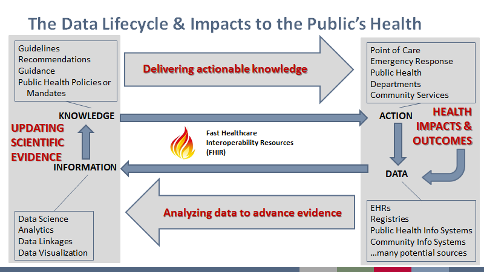
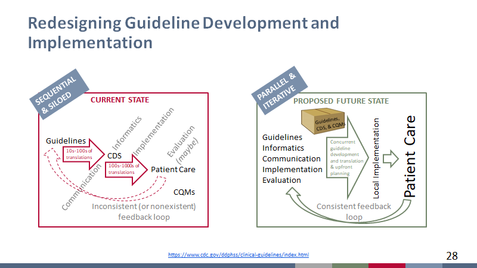
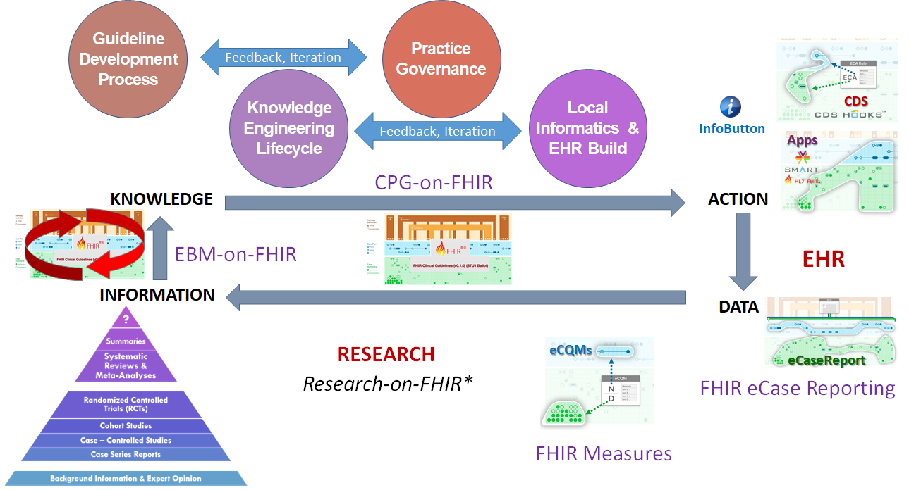
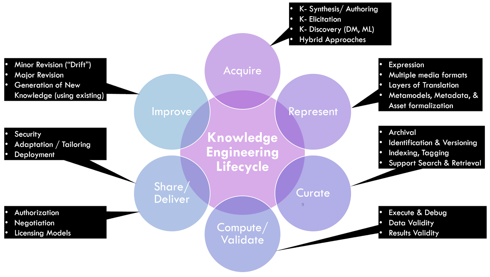
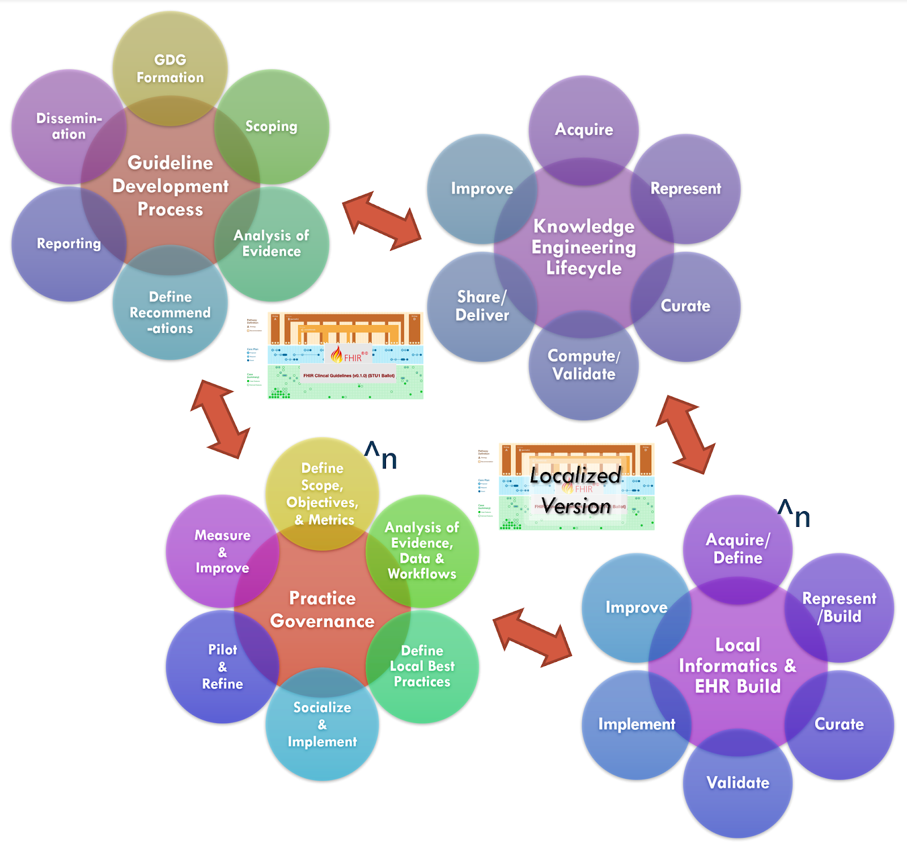
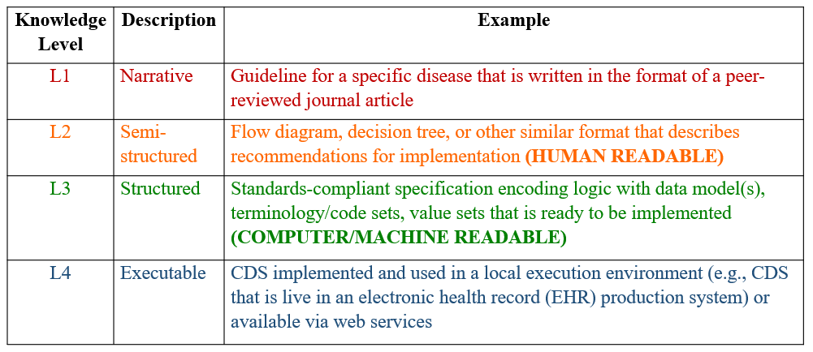
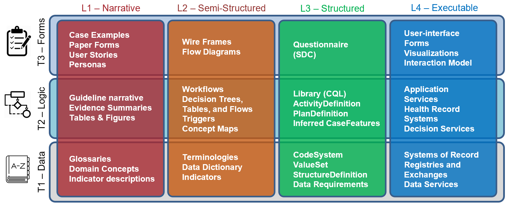

# **Clinical Practice Guidelines - Approach**

The approach section to this implementation guide describes how a guideline developers, informaticians (knowledge engineers and others), and implementers of computable representations of guidelines can collaborate across the lifecycle of guideline-directed care and related activities (clinical decision support, quality measurement, case reporting, continuous improvement), leveraging existing standards-based approaches.

# Overview of Approach

Topics covered in the Approach (see each section below for its content):

*   Executive Summary
*   Section 01: Introduction and Rationale <!-- Link to HIGH level Sections ## where exist from within bullets !-->
*   Section 02: Objective(s)
*   [Section 03: Levels of Conformance and Enablement](documentation-approach-03-conformance-levels.html)
*   [Section 04: Guideline Development](documentation-approach-04-guideline-development.html)
*   [Section 05: Knowledge Engineering](documentation-approach-05-knowledge-engineering-overview.html)
*   [Section 06: Knowledge Representation](documentation-approach-06-knowledge-representation.html)
*   [Section 07: Tiers of Functionality](documentation-approach-07-tiers-of-functionality.html)
*   [Section 08: Levels of Representation by Tiers of Functionality](documentation-approach-08-levels-of-representation-by-tiers-of-functionality.html)
*   [Section 09: Methods of Implementing Knowledge](documentation-approach-09-methods-of-implementation.html)
*   Section 10: Mechanisms of Integration
*   Section 11: Role and Benefits of Standards
*   [Section 12: CPG Knowledge Architecture (Conceptual)](documentation-approach-12-conceptual-knowledge-architecture.html)

Figure 01. **Clinical Quality Lifecycle with situated standards to address each respective phase.**  The CPG-IG addresses a critical gap in explicitly formalizing the guideline recommendations and other guideline features as computer-interpretable for downstream consumption and closing the feedback and feedforward loop(s).

# **Executive Summary for CPG Approach**

Translating guideline recommendations and other types of guidance into practice has historically been a site by site exercise that has been disconnected from guideline/guidance development, creating unnecessary redundancies and introducing potential errors in translation that can lead to inconsistencies in how the guideline or guidance is executed. This clinical practice guidelines implementation guide (CPG-IG) consists of standards and a standardized, scalable approach to help make the effort of translating and implementing clinical practice guidelines and other types of guidance more efficient and effective. Key aspects include:

1. An integrated guideline/guidance development and implementation process (referred to as “the integrated process”)
2. Common standards that can work across the entire data lifecycle (a.k.a. learning health system - see figure 2) and different electronic health record (EHR) platforms
3. Closed-loop guideline content and information flow inclusive of feedback and feedforward processes

Figure 02. **The data lifecycle and impacts to the public’s health** (Michaels, M, U.S. Centers for Disease Control and Prevention, 2019).  An updated version of this lifecycle directly related to the processes, approaches, and computable artifacts discussed in this section is shown below.

The integrated process (see figure 3) brings downstream implementation considerations and stakeholders into the upstream guideline/guidance development process by incorporating parallel and iterative development of tools (e.g., clinical decision support (CDS) or electronic clinical quality measures (eCQMs)) as the guideline/guidance is being developed. This includes gathering input from implementers (e.g., from the clinical and informatics perspectives at clinical sites) on feasibility and validity. This is done by incorporating implementers, knowledge engineers, and other downstream perspectives into the guideline development process to produce computer-interpretable artifacts that express the narrative guideline, delivering them as a “package”. Many downstream implementers can then consume and implement those standards-based artifacts without significant rework.

Figure 03. **Redesigning guideline development and implementation: The Integrated Process** (Michaels, M, U.S. Centers for Disease Control and Prevention, 2019). NOTE: The “Implementation” perspective represents local implementers that incorporate the local considerations into guideline translations, and “Local Implementations” represent the actual implementation at clinical sites.

In particular, the translation into tools like CDS and eCQMs applies common health IT standards like Fast Healthcare Interoperability Resources (FHIR) and Clinical Quality Language (CQL). How to use these standards to develop shareable, platform-independent tools based on guidelines/guidance for a variety of diseases, conditions, or preventive care is the primary focus of this CPG-IG, including this Approach section. Secondarily, this CPG-IG shows how using FHIR can help with other data-focused activities, such as public health reporting (i.e., using electronic case reports) or quality reporting (i.e., using eCQMs), that provide a feedback loop that feeds the evidence. The evidence can also be represented using FHIR (i.e., EBM-on-FHIR) and could be applied in summarizing evidence and updating guidelines/guidance. This completes the “data lifecycle” that allows for continuous learning and improvement – a “learning health system”.  The CPG-IG approach can be a key component of a learning health system in times requiring rapid response, where knowledge of best practice is not well-known.

# 1. **Introduction and Rationale**

**The purpose of the CPG-IG is to:**

*   Enable computable guideline specification to occur concurrently with guideline development;
*   Faithfully express guideline intent, including rationale and linkage to evidence-base;
*   Enable efficient and effective use and reuse of the guideline specification in downstream capabilities;
*   Accelerate the development of computable guideline specifications and interventions through an integrated, cross-functional, rapid-cycle (Agile) development process that is inclusive of local implementation;
*   More closely tie guideline intent, interventions, and measurements; and
*   Provide closed-loop (feedback and feedforward loops) across the knowledge, practice, and discovery or evidence ecosystems.

**Notes to Target Audiences:**

The CPG Approach section highlights:

*   Various highly specialized and technical participants in the “Knowledge-to-Delivery-to-Discovery” ecosystem that often interact with each other’s work products but may not interact directly with each other;
*   How the HL7 CPG-IG recognizes their distinct and valuable work and provides numerous opportunities to reuse domain standards (e.g., FHIR and other HL7 IG’s); and
*   A reconceptualization of work processes that share and reuse essential information and content.  

Much of this work has been informed by several international efforts, including the U.S. Centers for Disease Control and Prevention’s (CDC’s) Adapting Clinical Guidelines for the Digital Age initiative ([ref](https://www.cdc.gov/ddphss/clinical-guidelines/index.html)), the World Health Organization’s (WHO’s) Antenatal Care Guidelines ([ref](https://www.who.int/reproductivehealth/publications/maternal_perinatal_health/anc-positive-pregnancy-experience/en/)), the HL7 Clinical Decision Support Working Group, and numerous other publicly funded and private sector initiatives, including local health system implementations of guidelines and in-workflow pathways.

**To the Guideline Developer:** Working in parallel with knowledge engineers and other downstream consumers (e.g., local implementers) can identify areas within the guideline that need clarification, helping improve the narrative, provide opportunity to review the translation of the tools for fidelity to the guideline, and get early feedback from end-consumers of the guideline work product -- all _before_ the guidelines or tools are published.

**To the Knowledge Engineer:** Working in parallel with guideline developers allows validation of translations directly with the “source of truth,” helping ensure accuracy. Working in parallel with downstream consumers (e.g., local implementers) provides the ability to confirm feasibility and validity for the users of the artifacts as they are produced by knowledge engineers and may even provide a useful means to build and validate once (i.e., without unnecessary redundancy) against real-world data and implementations.

**To the Downstream Consumers:** Being involved with the guideline development and knowledge engineering can help identify issues early in the process and optimize incorporation of the knowledge into downstream products that aid in implementation, such as apps, measures, or other point-of-care tools, and significantly reduce the rework of re-engineering parts of the guideline, saving time and effort.

**To the Local Implementer:** The main goal of the knowledge developed is to implement it in practice. Having local implementers (both clinicians and informaticians) involved with guideline development and knowledge engineering allows for the ability to communicate anticipated issues for implementation so that guideline developers or knowledge engineers have the opportunity to adjust their respective products in order to help optimize the ease and positive impact of implementation.  A computable guideline representation can significantly reduce rework, saving time and effort for local implementations.

**To the Evidence Ecosystem:** Taking a holistic approach to guideline development and implementation includes considerations for learning and continuous improvement through feedback and feedforward loops. A number of activities in the knowledge ecosystem that serve specific functions (e.g., case reporting to public health, quality reporting to payers, quality/data reporting to medical society registries, etc.) could also help provide the evidence that can inform updates to the guidelines/guidance. This evidence may be based on patient-level, point-of-care guideline usage, and detailed tracking thereof, affording new means of collecting evidence.

Using approaches, standards, and techniques addressed in further detail in individual sections, the CPG-on-FHIR as described in this implementation guide can serve a critical role in the full data lifecycle of a Learning Health System.

Figure 04.** Data Lifecycle Revisited in context of the CPG-IG:**  With the guideline development group, the knowledge engineering team, and local implementation teams (practice governance and informatics/ EHR build) working collaboratively to develop and implement a CPG based on widely adopted standards (e.g., FHIR, CQL), there exists a synergy that can produce all the knowledge products more efficiently and effectively. (NOTE: CQM-on-FHIR refers to the FHIR Measure-IG; eCR-on-FHIR refers to the eCaseReport-IG; and Research-on-FHIR does not exist yet).

# 2. **Objectives**
*   **Direct:**
    *   Reduce duplicate development effort involved in the implementation of clinical practice guideline recommendations in clinical systems and accelerate time to broad delivery of best practices
    *   Reduce unnecessary and/or unintentional variability in clinical practice guideline implementation
    *   Reduce information loss and unnecessary rework in downstream implementation and related knowledge ecosystem activities that build on the guideline recommendations
    *   Pull forward point-of-use considerations (e.g., usability, explicit intent) while reducing ambiguity of the recommendations that often must be addressed in downstream translation activities
*   **Indirect:**
    *   Minimize the time needed to implement clinical practice guideline recommendations in clinical systems
    *   Reduce the rework for downstream derivative works such as decision support capabilities, guideline compliance (e.g., quality measures), feedback loops (e.g., case reports), and documentation requirements
    *   Accelerate the learnings from guideline-directed care by closing feedback/feedforward loops

The primary objective of the CPG approach to codifying clinical practice guidelines is to accelerate the translation and delivery of expert body evidence-based and best practice recommendations to the point of care. The CPG-IG was developed through multi-stakeholder engagement (e.g., guideline developers, knowledge engineers, clinical implementers, standards experts, patient and caregiver advocates, governmental and nongovernmental agencies, and others) to evolve the development approach and means of expressing clinical practice guidelines in computable formats.  These stakeholders identified the need to concurrently develop computable formats along with the narrative guidelines/guidance. As such, the knowledge engineering process, inclusive of elicitation, translation, specification, and formal representation, must be integrated with the guideline development process and serve the function of translating between the clinical domain and the formal, computable expressions thereof.  It is the intent of this section to describe some of the fundamentals of these activities as well as the concept, means, and performances to carry out this activity.

Secondarily, we describe how these activities interact with adjacent and related activities as well as content and related standards in the broader knowledge ecosystem (inclusive of evidence ecosystem, guideline developers, guideline-directed care, quality measure ecosystem, registry community, etc.). This includes upstream activities, such as evidence generation and knowledge discovery, and downstream activities, such decision support (i.e., CDS), patient care, advanced cognitive support (e.g., using SMART-on-FHIR apps), quality measurement and reporting, and electronic case reporting (for similarly scoped conditions). All can serve to inform subsequent iterations of clinical guidelines and guideline-directed care and thus have a key role in the learning health system.

# 3. **Conformance and Levels of Enablement** <!-- link to section 03 - !-->

Trade-offs between effort, time to develop, and capabilities enabled (and value that can be derived) when developing a CPG.  From very basic context for narrative snippets searchable in a library (or Infobutton from EHR) to full clinical workflow enablement, cognitive support, and pathway tracking (likely via SMART-on-FHIR App or deep EHR integration) as well as feedback loops with real-world evidence of actual guideline usage, measures, etc. and as substrate for evidence ecosystem and/or feedforward loop for evidence updates.  Fortunately, the CPG-IG includes levels of enablement that correlate to work effort, time to delivery, as well as capabilities that it can support as well as the means to iteratively, and successively develop CPG versions that provide incremental value by ascending these levels of enablement.

# 4. **Guideline Development Process** <!-- link to section 04 - !-->

Guideline development involves systematic review of evidence related to specific clinical question(s) and then producing a set of recommendations and supporting information.  This implementation guide provides sufficient context for developing a computer-interpretable representation of the final work product of the guideline development process.

Covered in this section:

*   Overview of the Guideline Development process
*   Description of the Guideline Development Group (GDG) and Scoping
*   Guideline Development Frameworks
*   6S Evidence Pyramid and Learning Health System(s)
    *   Evidence, Guidance, and Rapid Ascent to the Peak During an Emergency Response to a Novel Contagion Pandemic
*   Analysis of Evidence
*   Recommendations
*   Reporting and Dissemination
*   Development of Computable Clinical Guideline Artifacts

## **Recommendations**

Recommendations are proposals pertaining to the best course of action put forth by an authoritative source or body related to a condition, procedure, clinical decision, or activity.

## **Computer-enabled Guideline Artifacts in the CPG-IG:**

*   **Guideline** (CPG container)
    *   **Recommendations**
    *   **Case Features**
*   **Metrics and Measures** (scoped to CPG)
*   **eCaseReport** (scoped to CPG)

# 5. **Knowledge Engineering Overview** <!-- link to section 05 - !-->

Knowledge Engineering (KE) is the discipline and profession of developing explicit representations of advanced, domain-oriented logic in computer systems (i.e., knowledge-based systems) in order to simulate human decision-making and high-level cognitive tasks.

Covered in this section:

*   Knowledge Acquisition
*   Knowledge Translation
*   Knowledge Representation/Expression
*   Knowledge Execution and Validation
*   Knowledge Implementation
*   Agile Approach to CPG Development

Figure 05.  **The Knowledge Engineering Lifecycle**, illustrating the general flow of activities and information.

## **Knowledge Engineering Lifecycle Process**

The Knowledge Engineering Lifecycle Process describes a progressively interdependent series of activities or steps taken in order to transform domain knowledge/content into a more formal, computable set of assets for consumption, execution, and/or delivery.

Steps in the Knowledge engineering Lifecycle include:

*   Knowledge Acquisition
*   Knowledge Translation
*   Knowledge Representation/Expression
*   Knowledge Curation
*   Knowledge Execution
*   Knowledge Validation
*   Knowledge Implementation

Figure 06. **Knowledge Translation** is the dynamic and iterative process of conveying the concepts, clinical logic, and intent of a source knowledge expression (e.g., narrative guideline) into an equivalent expression in another language or formalism- in the case of a narrative guideline into a computeable or computer interpretable expression. This may occur successively or progressively across the Levels of Representation (L1, L2, L3) or may be directly to an L3/L4 expression, typically using an authoring tool or domain-oriented language.

Figure 07.  **Integration/Collaboration with Guideline Development Process and CPG Development Processes** - Analogs between GDG and PG as well as KE and Local Informatics with opportunities to work hand-in-hand, enabling earlier and less costly adaptations (feedback loops in process) and opportunities to collaborate on real-world data.  This combines the “Integrated Process” described above with Concurrent CPG Development and Implementation described in the Knowledge Implementation section.

### **Agile Approach to CPG Development**

Figure 08. **Concurrent, Integrated, Cross-functional Development and Implementation of the CPG-on-FHIR:**  The CPG can serve a critical role in formalizing guidelines and their recommendations in computer-interpretable representations that can be consumed by various downstream end-users and provide a means for feedback and feedforward loops.

# 6. **Knowledge Representation** <!-- link to section 06 - !-->

Knowledge can be represented in four progressively more structured levels: narrative (L1), semistructured (L2), structured (L3), executable (L4).

Figure 09. **Knowledge Levels with Examples** (Michaels, U.S. Centers for Disease Control and Prevention, 2019; Adapted from: Boxwala, AA, et al.. A multi-layered framework for disseminating knowledge for computer-based decision support. J Am Med Inform Assoc 2011(18) i132-i139).

**Knowledge Assets** (scoped representations of knowledge)

*   **Expressions**
*   **Declarations**
*   **Composed Assets**
*   **Derived Assets**

**Translation within and between Knowledge Representations**

**Knowledge Architecture:**

This implementation guide describes how the knowledge architecture for clinical practice guidelines has been manifested within FHIR Resources and the FHIR Architectural and Implementation Frameworks.

# 7. **Tiers of Functionality** <!-- link to section 07 ... draw from: http://build.fhir.org/ig/HL7/cqf-recommendations/documentation-approach.html !-->

This implementation guide defines three (3) tiers of functionality, very roughly analogous to the tiers of architecture in software engineering

*   **Data**
*   **Logic**
*   **User Interface (UI)**

# 8. **Levels of Representation by Tiers of Functionality** <!-- link to section 08 !-->

The levels of knowledge representation (L1-L4) can each be broken down into three tiers of functionality: data tier (T1), logic tier (T2), and forms tier (i.e., UI) (T3).

Figure 10. **Levels of Representation by Tiers of Functionality with Examples** (Rhodes, B, Dynamic Content Group, 2019).

# 9. **Methods of Implementation** <!-- link to section 09 !-->

With these computable artifacts, there are three (3) methods of implementation that broadly describe different approaches to moving from the computable representation (L3) of guideline content to the executable representation (L4):

*   As a “Spec”
*   Translation
*   Native Execution

# 10. **Mechanisms of Integration** <!-- Link to Section 10 ... Bryn to Provide, see Ballot Comment in Jira !-->

*   Within EHR (Content Import)
*   As a CDS Service (API)
*   ChainiCPG-Approach0ng through Data
*   Hybrid (combine above as needed)

# 11. **Role and Benefits of Standards in Knowledge-driven Systems and in a Knowledge 11** <!-- link to section 11 !-->

Standards facilitate a number of benefits that promote a more efficient and effective knowledge ecosystem:

*   Shareability
*   Reusability
*   Distribution of KE Effort
*   Optimization of value across use cases
*   Success in existing ecosystem
*   CPG as situated in the knowledge ecosystem (CQI image overlaid with IGs)

Figure 11. **Enabling and Removing Friction across a Knowledge Ecosystem through HL-7 Standards**

Figure 12. **Concurrent, Integrated, Cross-functional Development and Implementation of the CPG-on-FHIR:**  The CPG can serve a critical role in formalizing guidelines and their recommendations in computer-interpretable representations based on standards that can be consumed by various downstream end-users as well as provide a means for feedback and feedforward loops.

# 12. **CPG Knowledge Architecture (Conceptual Perspective)** <!-- link to section 12 !-->
*   **Plan**
    *   **Recommendations** (the activity the guidelines tell you to do or not to do)
    *   **Strategies** (organize or orchestrate recommendations)
    *   **Pathways** (Eligibility, Enrollment)
*   **Case**
    *   **Case Features** (describe some aspect of a patient)
*   **Care Plan**
    *   **Proposals** (patient-specific recommendations)
    *   **Requests** (the orders or activities resulting or related to the proposal)
    *   **Events** (resulting or related to the request and/or proposal)
*   **Workflow and Common Pathway**
*   **Related or Derived Assets**
    *   **Guideline** (container for all CPG assets)
    *   **Metrics** (patient-level indicator of compliance, adherence, and end- and intermediate-outcomes related to guideline-directed care)
    *   **Measures** (population-level compliance, adherence, and end- and intermediate-outcomes related to guideline-directed care; uses Measure-IG)
    *   **CaseSummary** (roll-up of all the case features)
    *   **CasePlanSummaryView** (roll-up of case features and care plan with respect to some scope)
    *   **CasePlanProgressingNote** (roll-up of case features, care plan, and clinical impressions with respect to a point in time or event)
    *   **eCaseReport** (any data from the CPG relevant to the reporting body; uses eCaseReport-IG)

## **Separation of Concerns**

Figure 13. **Illustrating the separation of the Case** (patient clinicopathophysiological processes and their manifestations and qualifications thereof), **the Plan** (the approach to the patient’s current, historical, and potential future state of disease and well-being including medical decision-making), and **the Workflow** (how the Plan is implemented either through interactions with clinical information systems or through real-world human tasks and activities).

## **Plan**

The plan, in the CPG context, as described above in “Separation of Concerns,” addresses how the care team intends to address the active clinical concerns of a class of patients.  Uses the FHIR Plan Definition resource.

Figure 14. **The Plan describes Recommendations for best practice care** including many aspects of the clinical decision-making processes in the context of patients’ current and historical state (i.e., Case, and scoped Case Features); Strategies for addressing key clinical issues that may require decisions, planning, and orchestration across multiple recommendations; and an overall Pathway that similarly coordinates across Strategies and Recommendations to be applied to individual patients in the broader collective of the Case and its Case Features resulting in a patient-specific Care Plan.  The Plan is “definitional” and is represented by [FHIR Resources that follow the Definition](http://hl7.org/fhir/definition.html) pattern.  If logic describes what to do for a patient, it likely belongs in the Plan.

## **Case**

The data that expresses a Case consists of patient descriptors, exposures (e.g., environmental or behavioral, past and current medications and procedures), physiological and pathophysiological assessments and descriptions (e.g., labs, vitals), clinical presentation and progression (e.g., signs, symptoms), diagnostic evaluations and physical exam findings, family history and genetic markers, past and current diagnoses, or risk and severity scores in response to treatment, including end- and intermediate-outcomes.

Figure 15.  **The Case consists of facts or information about the patient called Case Features (CPGCaseFeatures)** that may be resolved by [FHIR Resources following the Event pattern](https://www.hl7.org/fhir/event.html) and [FHIR Resources following the Request pattern](https://www.hl7.org/fhir/request.html) as required data elements or inferred, in part using required data elements.  If an inference (logic) tells you something about the patient, it is almost certainly a Case Feature.

## **Care Plan**

The Care Plan describes the intention of how one or more healthcare professionals intend to provide care for a specific patient, group, or community for a period of time, possibly limited to care for a specific condition or set of conditions.

Figure 16. **The Care Plan consists of the patient-specific recommendations as Proposals, [Requests](https://www.hl7.org/fhir/request.html) that correspond (or are related) to the Proposals, and the corresponding or related [Events](https://www.hl7.org/fhir/event.html).**  NOTE: Requests and Events are also referenced by the Case as CPGCaseFeatures.

Figure 17. **Conceptual overview of the CPG Knowledge Architecture and its separation of concerns**. The top third illustrates the conceptualization of the CPGPlan consisting of the CPGPathway Definition, CPGStrategyDefinition, and CPGRecommendation Definition. The bottom third illustrates the CPGCase consisting of all the patient descriptors, including exposures, physiological and pathophysiological assessments and descriptions, clinical presentation and progression, diagnostic evaluations and physical findings, past and current diagnoses and procedures, related risk and severity scores, and family history and genetic profile as CPGCaseFeatures.  The middle third illustrates the CPGCarePlan with its CPGProposals and resulting or related Requests and Events.
