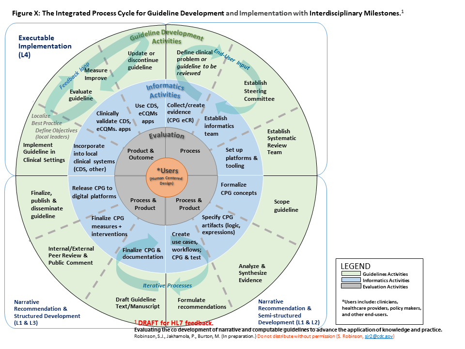

## Development of Computable Clinical Guideline Artifacts

### Evidence

Evidence and information from the evidence used and referenced in the guideline recommendations may be formalized as FHIR Evidence Resources with their respective Evidence Variables using the EBM-on-FHIR IG.  Similarly, the published guideline narrative may be formalized through the same approach using this CPG-on-FHIR IG as discussed in the [Analysis of Evidence](documentation-approach-04-04-analysis-of-evidence-recommendations-reporting.html) <!-- link to - 04.04 !--> section.

### Co-Development of Guidelines and Computable Clinical Guideline Artifacts

The integrated process describes co-development of the narrative and computable guidelines that brings together a number of desirable elements that include:
*	An approach that includes guideline and artifact development, implementation, consideration for updating and discontinuation, and evaluation
*	Promotes active collaboration (integration) of key subject matter experts thought the process.  These include:
    *	Guideline developers
    * Informaticians
    * Implementers
    * Communicators
    * Evaluators
* Provides for active iteration of key steps of the guideline development and implementation processes to assure that intermediate and final products are optimized and fit for purpose.
* Includes robust process, product, and outcomes/impact evaluation frameworks to assure guideline development and implementation is efficient, cost-effective, and impactful (this element in development)

#### The Integrated Process Cycle

Figure 04.05-01 represents how guideline developers, informaticians, implementers, and evaluators can integrate their workflows to co-develop, implement, and evaluate narrative and computable guidelines in iterative phases and steps.  The diagram is divided into quadrants that correspond with “layers of knowledge” proposed by Boxwala et al for computer-based decision support.[2](#2) See explanation below diagram for additional details.

FIG 04.05-01: The Integrated Process Cycle for Guideline Development and Implementation with Interdisciplinary Milestones.[1](#1)

The outer circle shows 12 phases of formal guidelines development that result in published narrative recommendations. The middle circle represents the integration of informatics and clinical implementation activities into the guideline development 12 phase process. This circle adds iterative steps within and between the phases and that 1) inform written guidelines, and 2) result in a computable version of  guidelines that can be more rapidly implemented in clinical settings. The inner circle represents the evaluation activities that should be conducted throughout guideline development, with constant attention to meeting the needs of users. This integration is designed to facilitate use of guidelines in clinical practice and timely updates to guidelines based on clinical impact. Finally, at the center of the process are the guideline users, who should be engaged through human-centered design processes in all phases (shown by spiral connections).

<a id="2">2</a>: Boxwala, Aziz A., et al. "A multi-layered framework for disseminating knowledge for computer-based decision support." Journal of the American Medical Informatics Association 18.Supplement_1 (2011): i132-i139.

### CPG Content and Related Derivatives

1. **Recommendations:** In the CPG context, recommendations are represented and expressed through a profile on the FHIR Plan Definition (CPGRecommendation) largely derived from the ECA Rule profile.  The recommended intervention corresponds to the “action” portion of an ECA rule and is largely expressed as a Request through an Activity Definition.  The applicability criteria and/or decision logic for a recommendation largely corresponds to the “condition” portion of an ECA rule and is largely expressed using a combination of scoped CQL (population criteria, decision logic, inferred data elements) and FHIR Plan Definition (e.g., as a Decision Table). “Events” of the ECA rule, correspond to either the state of or changes to the patient’s clinical condition (data change event) as described in the recommendation (e.g., new diagnosis of, risk score exceeds limit, blood pressure drops below threshold), or an (abstract) patient or clinician workflow activity, the passage of time with respect to some anchoring event, or some combination thereof.  See [CPGPlan](documentation-approach-12-03-cpg-plan.html) <!-- link to - 12.03 !--> in Conceptual CPG Knowledge Architecture section for more details on CPGRecommendations.
2. **Guideline & Strategies:**  The broader guideline includes strategies for relating, sequencing, or orchestrating individual (or groups of) recommendations and is represented and expressed through separate profiles on the  FHIR Plan Definition (CPGPathway and CPGStrategy).  A CPGStrategy is used to correlate, orchestrate, and/or provide decision logic between a set of related recommendations often scoped to a particular clinical issue (e.g., diuresis in inpatient heart failure management). A CPGPathway serves a similar function across Strategies and scopes the entire guideline.  See [CPGPlan](documentation-approach-12-03-cpg-plan.html) <!-- link to - 12.03 !--> in Conceptual CPG Knowledge Architecture section for more details on CPGStrategies, CPGPathways, and CPGGuidelines.
3. **Metrics and Measures:**  A CPGMetric is a patient level measurement or indicator of recommendation compliance and/or guideline adherence (corresponding to a process measure), reaching a stated goal or objective (corresponding to an end or intermediate outcome), or current status of a clinical activity.  A CPGMeasure is a population level measurement typically corresponding to an aggregate of patient level CPGMetrics and/or other parts of the CPG.  For a CPGMeasure, the initial patient population often corresponds to the CPG eligibility criteria, while the denominator is often constrained by individual recommendation applicability criteria (including exclusion or contraindication criteria), and the numerator may correspond to satisfaction criteria (order placed or activity performed)  for guideline recommendation or proposal compliance in the case of process measures, or goal or threshold attainment in the case of outcome measures.  CPGMeasure Initial Patient Populations definitions and CPGPathwayElligibilityCriteria will likely have significant overlap in many cases.  CPGRecommendation logic (applicability criteria) similarly will overlap with denominator, denominator exclusion, risk stratifications, and numerator criteria.  See [CPG Derivative & Related Assets](documentation-approach-12-07-cpg-derivative-and-related-assets.html) <!-- link to - 12.07 !--> in Conceptual CPG Knowledge Architecture section for more details on CPGMetrics and CPGMeasures.
4. **eCaseReport:**  A CPGeCaseReport is intended to convey the set of data elements required to provide for more detailed outcomes research on the guideline topic itself as well as for a feedback loop for continuous improvement of the specified  guideline.  The data elements for a CPGeCaseReport come from the data requirements (CPGCaseFeatures), key inferences thereof (inferred CPGCaseFeatures), patient specific recommendations (CPGProposals), and the corresponding orders and resulting clinical activities (requests and resultant events from CPGCaseFeatures).  Additional or supplemental data elements (data requirements and inferences) for informing identified guideline gaps or feedback loops may be further specified for inclusion in the CPGeCaseReport. See [CPG Derivative & Related Assets](documentation-approach-12-07-cpg-derivative-and-related-assets.html) <!-- link to - 12.07 !--> in Conceptual CPG Knowledge Architecture section for more details on CPGeCaseReports.

### Value of Computable Guideline Artifacts to Stakeholders

**For Guideline Development Group, especially Medical Specialty Societies**- Actionable and meaningful usage of and feedback on guideline recommendations; (automated) data collection of data elements relevant to the scope of the guideline (registries); significant number of process of care level and intermediate- and end-outcome metrics and quality measures scoped to the guideline; active and highly relevant participation in the Learning Health System.

**For Providers and Health Care Organizations**- Nearly automated data collection for clinical registries (internal, professional societies, and accreditation); a significant number of process of care level and intermediate- and end-outcome metrics and quality measures; readily available means to implement, monitor, and measure guideline-directed care; benefits derived from participation in the Learning Health System.

**For the Evidence Ecosystem**- Utility of evidence and new high-value, patient and process of care level evidence to “climb the pyramid”.

**For modern and emerging methods of Knowledge Discovery**- numerous opportunities to leverage value of methods and data assets (data-to-knowledge); new high-value evidence substrate to reason over (enriched data, guideline usage, knowledge artifacts created across the value-chain).  (see section on [Knowledge Acquisition](documentation-approach-05-01-knowledge-acquisition.html)) <!-- link to - 05. !-->
