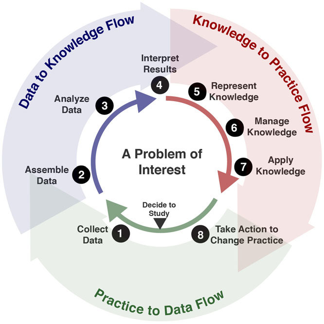

# Guideline Development

Guideline development consists of a community of practice made up of numerous professionals with expertise and skills in various clinical/scientific fields.  This implementation guide does not describe the guideline development process in complete detail. However, it gives an overview to provide sufficient context for the rest of the implementation guide since the scope for the CPG is to provide a computer-interpretable representation of the final work product of the guideline development process.

Covered in this section:

*   Overview of the Guideline Development process
*   [Description of the Guideline Development Group (GDG) and Scoping](documentation-approach-04-01-guideline-development-group.html)
*   [Guideline Development Frameworks](documentation-approach-04-02-guideline-development-frameworks.html)
*   [6S Evidence Pyramid and Learning Health System(s)](documentation-approach-04-03-6S-evidence-pyramid-and-learning-health-systems.html)
    *   Evidence, Guidance, and Rapid Ascent to the Peak During an Emergency Response to a Novel Contagion Pandemic
*   [Analysis of Evidence](documentation-approach-04-04-analysis-of-evidence-recommendations-reporting.html)
    *   Recommendations
    *   Reporting and Dissemination
*   [Development of Computable Clinical Guideline Artifacts](documentation-approach-04-05-computable-guideline-artifacts.html)

Clinical practice guidelines are systematically developed statements to assist clinical practitioner and patient decisions about appropriate care for specific clinical conditions, procedures, and/or similarly scoped activities. Guidelines consist of recommendations for patient care, which are based on scientific research and data (evidence), vetted through rigorous processes of a review and synthesis by recognized domain and methodological experts and other key stakeholders (e.g. patient and caregiver advocates) to guide healthcare decisions and activities for defined scope. A guideline may consist of one or more recommendations, contextualizing information, the possible means or strategies for bringing together or orchestrating recommendations, and other relevant considerations. A recommendation is a proposal pertaining to the best course of action put forth by an authoritative source or body (e.g. governmental or professional society convened guideline development group).  More detailed descriptions of and best practices for the guideline development process may be found at numerous publicly available resources (e.g.,  [https://www.ncbi.nlm.nih.gov/books/NBK209539/pdf/Bookshelf_NBK209539.pdf](https://www.ncbi.nlm.nih.gov/books/NBK209539/pdf/Bookshelf_NBK209539.pdf); [https://cebgrade.mcmaster.ca/guidelinechecklistonline.html](https://cebgrade.mcmaster.ca/guidelinechecklistonline.html); [https://doi.org/10.7326/0003-4819-153-3-201008030-00010](https://doi.org/10.7326/0003-4819-153-3-201008030-00010); [https://www.nccih.nih.gov/health/providers/clinicalpractice](https://www.nccih.nih.gov/health/providers/clinicalpractice)) <!-- convert refs to links !--> and are beyond the scope of this document, though a few key concepts will be covered.

FIG 18. Overview of the phases of the guideline development process that generally occur sequentially, but may be overlapping and concurrent particularly for different recommendations within a guideline.

## **Guideline Development Group** <!-- GET RID OF SECTION 4.01- ALL is in HERE NOW (???)  [Description of the Guideline Development Group (GDG) and Scoping](documentation-approach-04-01-guideline-development-group.html) !-->

The guideline development group is the multi-stakeholder, cross-functional team assembled to develop the guideline. It often includes members from the target audience (specialist and primary care clinicians), content experts, patients and caregivers, front-line clinicians, evidence-based practice experts, outcomes and quality experts, usability experts, experts in medical and shared decision-making, methodology experts, and experts in health economics. ([https://cebgrade.mcmaster.ca/guidelinechecklistonline.html#GuidelineGroupMembershiptable](https://cebgrade.mcmaster.ca/guidelinechecklistonline.html#GuidelineGroupMembershiptable)).

For the digital CPG, we will need to add a few more experts to the guideline development group or have a few key resources serve cross-functional roles with a Knowledge engineering team (see section on “Knowledge Engineering”).  These may include experts in creating computable representations of the guideline such as: knowledge extraction and/or elicitation, terminologists and/or ontologists, clinical research informatics ([ref](https://www.amia.org/applications-informatics/clinical-research-informatics)), clinical informatics, clinical decision support, cognitive informatics, knowledge formalism and expression, measurement science and measure development, user experience (UX), and user-centered design.  These experts often start with a “paper” or narrative guideline but will likely produce much higher fidelity, accurate, and usable expressions of the guideline through a more “agile” approach to concurrent, integrated, and cross-functional approach to guideline development and knowledge engineering.

## **Scoping**

Scoping refers to the process and establishment of criteria to describe and constrain the focus of the guideline. It addresses who is the target user of the guideline,who it applies to, and what is addressed in the guideline. This is typically based on various factors, including high prevalence and burden of disease, avoidable mortality and morbidity, high cost, emerging diseases or emerging care options, variation in clinical practice, and rapidly changing evidence. The PICOTS Typology (i.e., population, intervention, comparison, outcome, timeframe) is often used in scoping and correlates closely to the eligibility criteria for the CPG  ([https://cebgrade.mcmaster.ca/guidelinechecklistonline.html#Prioritytable](https://cebgrade.mcmaster.ca/guidelinechecklistonline.html#Prioritytable)).

## **Guideline Development Frameworks**  <!-- link to 04.02 [Guideline Development Frameworks](documentation-approach-04-02-guideline-development-frameworks.html) !-->

The following Frameworks are used in Guideline development and across the evidence ecosystem:

**Knowledge Synthesis and the Evidence Pyramid**

Knowledge synthesis is the process in professional community of practice that applies and develops methodologies for systematically evaluating a corpus of evidence related to a particular condition or intervention.

FIG. 18.  The Evidence Pyramid refers to a means to evaluate the quality or validity of evidence (higher toward the top) as well as provide a visual depiction of the amount of evidence (width) ([ref](http://dx.doi.org/10.1136/ebmed-2016-110401)).  The evaluation of the evidence not only informs the guideline development process and resulting recommendations but is further communicated together with the recommendations themselves using the GRADE framework, described below.

**PICOTS Typology** Patient population, Intervention, Comparator, Outcomes, Timing, Setting. For more on using PICOTS within HL7 Standards, see the EBM-on-FHIR IG (EBM: Evidence-Based Medicine).

**GRADE** (**G**rades of **R**ecommendation **A**ssessment, **D**evelopment and **E**valuation) - GRADE describes a process and a structured framework for conveying information to develop a common, transparent, and sensible system for grading the **quality** of evidence and the **strength** of recommendations.

**The CPG enables the System Level of the 6S Pyramid and Learning Health Systems**

The 6S Evidence Pyramid is another framing on the quality or validity of the evidence that may be of particular interest to the CPG-IG (implementation guide)  ([ref](https://doi.org/10.7326/0003-4819-151-6-200909150-02002)).  The highest level is Systems where information from the lower levels of the hierarchy are integrated with individual patient records (e.g., CPG content delivered into clinical workflow using real-world evidence with patient data)

FIG. 19. The 6S Evidence Pyramid with Systems Level (integration of lower levels of evidence into direct patient care) at the peak.

FIG. 20. The Learning Health System is another perspective on integrating evidence directly into practice and then using practice-level data to further inform evidence (ref)

**Evidence, Guidance, and Rapid Ascent to the Peak During an Emergency Response to a Novel Contagion Pandemic:**

Clearly there are many benefits to enable such a “peak of the pyramid” approach to tightly integrating guideline-directed care and cycling the “Learning Health System” for any condition and at any point in time.  Many of the approaches, capabilities, best practices, tools, and techniques described in this implementation guide are certainly as, if not even more, relevant to these situations.

*   **Rapid Discovery of Best Practice**
*   **Rapid dissemination of Practice Guidance**
*   **Rapid-cyle, closed loop Knowledge-to-Delivery-to-Discovery with feedback loops**

## **Analysis of Evidence**

Analysis of evidence includes systematic approaches for evaluating the evidence to inform the guideline and individual recommendations.

**Information from the Evidence:**

There is a significant amount of information contained within the various evidence sources.  PICOTS as described above is one systematic means of extracting information from the evidence that may be particularly useful in the CPG.

**EBM-on-FHIR for Information from the Evidence:**

The evidence contains valuable information that is not only used in the guideline development process, but often for and in the guideline and recommendations themselves.  

The formalization of this information from the evidence provides significant advantage (reuse or at least a reasonable starting point to work from) in the formalization of the guideline and guideline recommendations in the knowledge engineering lifecycle process for the CPG.

## **Recommendations**

Recommendations are proposals pertaining to the best course of action put forth by an authoritative source or body related to a condition, procedure, clinical decision, or activity. Often, they also call out portions of a recommendation and/or how the recommendations hang together that lack evidence and may have relied on expert consensus.

Additionally, if the guideline development group includes measure development expertise, it may provide guidance on whether each recommendation could be a good candidate for performance/quality measurement.

## **Reporting and Dissemination**

Reporting is often done through an official, formal guideline report intended for a target audience. Dissemination to measure development organizations, CLinical Decision Support (CDS) vendors, EHR vendors, registry vendors, and/or SMART-on-FHIR application developers could be included for computable CPGs.

## **Development of Computable Clinical Guideline Artifacts**

### Evidence

Evidence and information from the evidence used and referenced in the guideline recommendations may be formalized as FHIR Evidence Resources with their respective Evidence Variables using the EBM-on-FHIR IG.  Similarly, the published guideline narrative may be formalized through the same approach using this CPG-on-FHIR IG..

### CPG Content and Related Derivatives

**Recommendations:** In the CPG context, recommendations are represented and expressed through a profile on the FHIR Plan Definition (CPGRecommendation) largely derived from the ECA Rule profile.

**Guideline & Strategies:**  The broader guideline includes strategies for relating, sequencing, or orchestrating individual (or groups of) recommendations and is represented and expressed through separate profiles on the  FHIR Plan Definition (CPGPathway and CPGStrategy).

**Metrics and Measures:**  A CPGMetric is a patient level measurement or indicator of recommendation compliance and/or guideline adherence (corresponding to a process measure), reaching a stated goal or objective (corresponding to an end or intermediate outcome), or current status of a clinical activity.  A CPGMeasure is a population level measurement typically corresponding to an aggregate of patient level CPGMetrics and/or other parts of the CPG.

**eCaseReport:**  A CPGeCaseReport is intended to convey the set of data elements required to provide for more detailed outcomes research on the guideline topic itself as well as for a feedback loop for continuous improvement of the specified guideline.  The data elements for a CPGeCaseReport come from the data requirements (CPGCaseFeatures), key inferences thereof (inferred CPGCaseFeatures), patient specific recommendations (CPGProposals), and the corresponding orders and resulting clinical activities (requests and resultant events from CPGCaseFeatures).

**Value to Stakeholders:** <!-- Needs Written !-->

*   For guideline development groups, especially Medical Specialty Societies-
*   For Providers and health care organizations
*   For the Evidence Ecosystem
*   For modern and emerging methods of Knowledge Discovery
