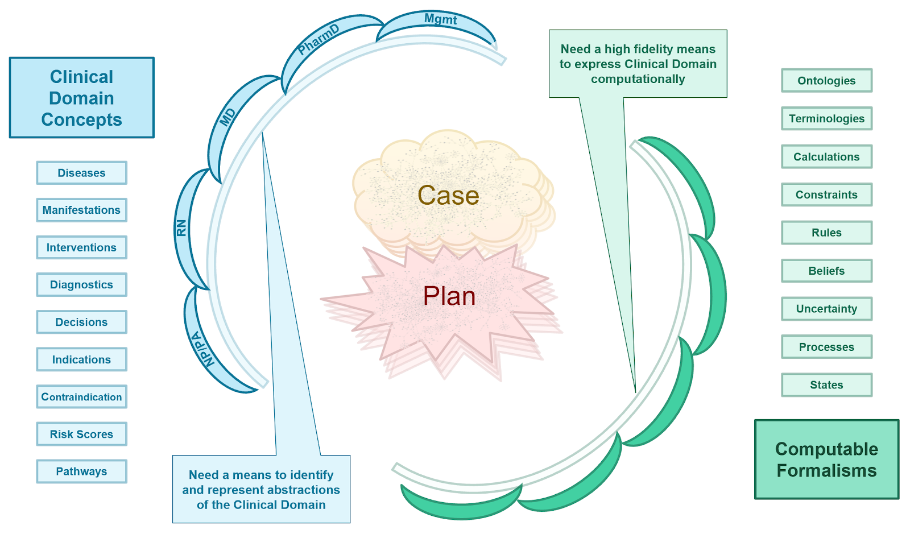
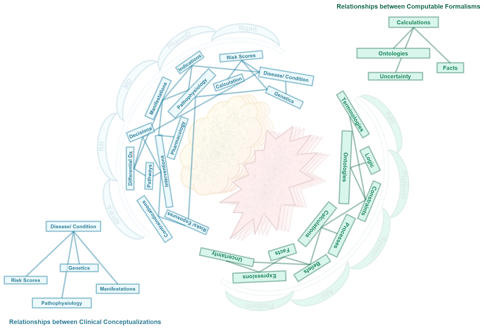
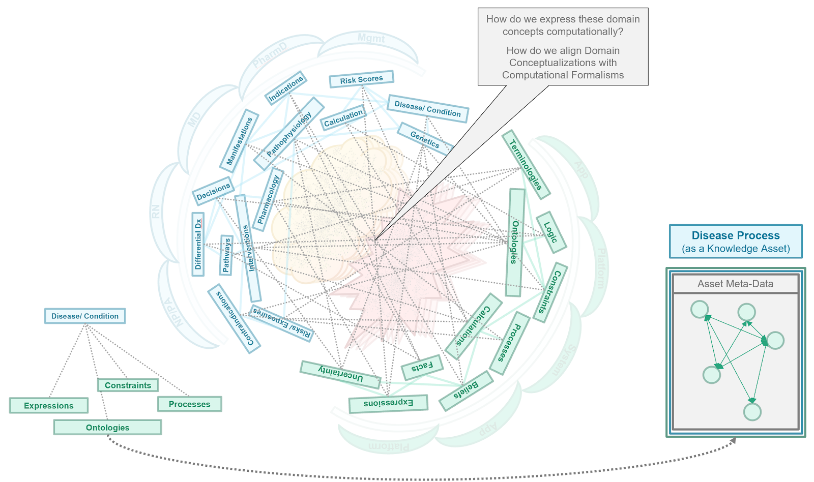
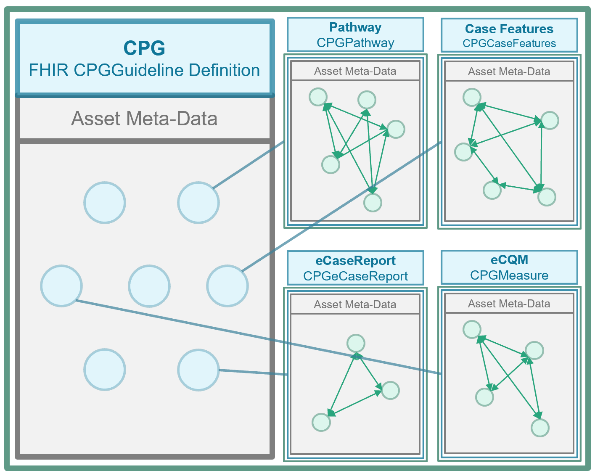

**Knowledge Architecture:**

Knowledge architecture is the discipline of information system architecture (Industry, Enterprise, Solution) with a focus on the principles, best practices, means, and mechanisms by which the knowledge assets for the architecture's given domain are managed including: acquiring, representing, stored, and organized.  Knowledge architecture includes defining the types and scopes of the various assets, their metadata, as well as their relations.  This description of the the types and nature of knowledge assets, including the definition of their metamodels including relationships to and in the context of  each other (derived, composite, and related assets), may be referred to as the knowledge asset ontology.

Covered in this section:

*   Key Challenges for Knowledge Architecture
*   Best Practices and Needs to be addressed
*   Key Principles and consideration
*   Knowledge Architecture Principles as applied to the CPG
*   Developing the CPG Knowledge Architecture
*   Conceptual Perspective on the CPG Knowledge Architecture
*   Knowledge Architecture in FHIR for the CPG-IG
*   Boundary Issues at the Separations of Concerns
*   Knowledge Architecture and Knowledge Content Management System

The CPG Knowledge Architecture ([Conceptual Domain Perspective](documentation-approach-12-conceptual-knowledge-architecture.html)) <!-- Link to - 12 !--> is described in its own section of this implementation guide.

FIG. 51. The knowledge architecture affords a means to formally describe the clinical domain using computer-interpretable formalisms.  The knowledge architecture defines the type and scope of various knowledge assets as well as the relationships between them and their requisite metadata.  It explicitly defines the nature of classes of knowledge assets through their metamodel. These definitions as well as definitions of the relationships between the knowledge asset types constitutes the knowledge asset ontology.

Furthermore, as various asset types and/or their derivatives share many common characteristics, the knowledge architects attempt to use common approaches and information modeling concepts to ensure optimal reuse, adaptation, and subtyping across knowledge asset meta-model definitions. In FHIR, this is done through profiling of definitional resources (e.g. plan definition, activity definition) and is enforced largely through a common approach in tooling to creating these asset type profiles.

Similarly, to ensure reusability, derivation, association, and adaptability as well as reduce rework and confusion by the knowledge engineering team a consistent and accurate definition for knowledge asset metadata is often defined in what may be referred to as the knowledge asset metadata meta-model.  In FHIR, this is done in part through architectural oversight of resource and attribute definitions as well as through the use of a common, shared Metadata resource.

2 <!-- 3 Paragraphs NEED WRITTEN. Need Integration Mechanisms from Bryn added HERE TOO. PARAGRAPH on LxTxM2 PARAGRAPH on Composition and Derivation in the KA PARAGRAPH on De Novo KA vs KA in an existing ecosystem **Key challenges for Knowledge Architecture lie in:**. Will add later and toward BOTTOM !-->

*   Identifying accurate, representative, unambiguous, and useful domain knowledge abstractions;
*   Enabling accurate and suitable computable representations (or formalisms) of those domain abstractions;
*   Assuring that these computable knowledge representations ensure the highest fidelity of shared meaning between artifacts directly consumed and/ or generated by domain experts and ‘computers’
*   Provide sufficient affordances for the support of the entire lifecycle and evolution of domain and executable knowledge
*   “FItting” with and being used within an existing ecosystem and various communities of practices and technologies within it is to be used
*   Enabling evolution and adaptation, or degrees of freedom, within all Tiers of Functionality both for individual assets, as well as collections thereof- including considerations for numerous alternative localizations

**Needs and best practices include:**

*   Afford Reliability as well as Continually Evolve and Expand upon the knowledge content (know general nature of knowledge, not just specifics) with minimal (or even positive) impact on the Adaptability and Resilience of the rest of the Architecture.
*   Knowledge Assets for the given domain, business, or product (for which the architecture belongs) are Managed including: created, captured (“elicited”), stored, versioned, organized, shared/ exchanged, executed/consumed, delivered and presented.
*   Systematic means by which to Abstract core knowledge assets for optimal (re-)use and continual evolution throughout the broader architecture.
    *   Appropriate or optimal Separations of Concerns including by classifying various Types or Kinds, Representations, and Expressions of knowledge and
    *   The Methods/Operations, Interfaces, and Parameters by which they are operated upon as well as interact within the broader architecture.
*   Ideally, there would be One Source of Truth for any given ‘business logic’ (knowledge) to be consumed or utilized by numerous components/features throughout the entire architecture and this source of truth is or can be wholly severable from a specific implementation.  
*   To behave as such, a knowledge architecture must not only respect the general Knowledge Architecture principles mentioned so far, but also respect the nature (kind) of knowledge for the domain or business in which it is to be used, or even more so, faithfully (and holistically) reflect the domain or business.  Therefore, Knowledge Architecture is at least as much about the domain itself (e.g. Academic Medicine, Healthcare, Evidence Ecosystem) as it is the general nature of (computable) knowledge.

Knowledge Architecture in the healthcare domain poses a particularly challenging domain to architect knowledge for, and for which knowledge architecture approaches, decisions, and implementations can have significant impact on the usability and value of assets as well as for the efficiency and overall effort of the knowledge engineering team(s).  Furthermore, the participants in these activities include a broad and deep representation of highly technical and specialized skills and foundational knowledge including clinical medicine and healthcare delivery, computational sciences and software engineering, knowledge and evidence ecosystem participants, and the knowledge engineering discipline.

**Key considerations and principles:**

*   Separations of Concerns- within and across the domain conceptualizations, between knowledge formalizations, and across the translations or transformations thereof
*   Fidelity to Domain Conceptualizations- oversimplification leads to unwieldy and value diminishing complexity to correct for, while appropriate complexity to align with the domain yields optimal representations and their formalization
*   Use of appropriate (well-fit) representations, expressions, and other formalisms within individual knowledge assets to address the nature of the domain conceptualizations for which they are intended to express
*   Layers of Abstraction- abstraction layers are a means of hiding some of the working details of subsystems, thus enabling the separation of concerns, particularly for boundary issues at these separations.  To do so, abstraction layers may even have multiple levels.  One typically finds programmatic interfaces and/or specialized logic to address these layers of obstruction
*   Sharing of knowledge formalisms across asset types to minimize complexity, optimize value, and reuse knowledge engineering skill sets
*   Existence and usage of content, information, formalisms, and interfaces that already exist within and/or across the ecosystem where possible and appropriate (e.g. fit-for-purpose)

**Knowledge Architecture Principles as Applied to the CPG**

*   Separation of Concerns in the CPG, see the subsection in the  CPG Knowledge Architecture (Conceptual Perspective) on [Separation of Concerns](documentation-approach-12-01-separations-of-concerns-in-the-cpg.html). <!-- link to - 12.01 - Separations of Concerns !-->
*   Domain Conceptualizations in the CPG, see the section on CPG Knowledge Architecture ([Conceptual Perspective](documentation-approach-12-conceptual-knowledge-architecture)) <!-- link to - 12 !-->
*   Fitting Representation/ Expressions see the individual Profiles <!-- link to - Profiles !--> in the CPG as well as how they are employed in the [Methodology](documentation-approach-09-methods-of-implementation.html) Section <!-- link to - Medhodology !-->
*   Layers of Abstraction is largely done within and across the knowledge assets definitions themselves described in the respective sub-section on [Knowledge Assets](documentation-approach-06-02-knowledge-assets.html) <!-- link to - 06.02 - Knowledge Assets !--> in the Knowledge Representation section
*   Sharing of Formalisms is in large part why to HL-7 FHIR and many of its various features; though other standards-based formalisms may be employed as well such as is discussed in the BPM+ implementation in [Methodology](documentation-approach-09-methods-of-implementation.html) Section <!-- link to - Medhodology !-->
*   Ecosystem ease of use is another reason to use HL-7 FHIR and in particular the various related Application Programming Interfaces (APIs) (FHIR Data Access, CDSHooks, SMART-on-FHIR, etc.)

**Developing** **the CPG Knowledge Architecture**

Here we describe the overall knowledge architecture approach to developing the CPG knowledge architecture, which then results in the Conceptual Perspective on the CPG Knowledge Architecture as well as the concretized Knowledge Architecture in FHIR for the CPG-IG described subsequently.

FIG. 52.   One of the primary objectives for the knowledge architecture team is to define the clinical domain concepts as well  as identify the useful computer-interpretable formalisms that may be used to express them.

FIG. 53.  The knowledge architecture team must then situate the clinical domain concepts to more accurately and comprehensively describe the domain of interest as well as situate the computer-interpretable formalisms in the information system ecosystem where the knowledge assets are to be executed.

FIG. 54.  Next, the knowledge architecture team defines clear relationships between the clinical conceptualizations of the domain as well as how the computer interpretable formalisms may be used collectively to express the nature of behavior to be represented in the knowledge assets that formalize the clinical domain conceptualizations.

FIG. 55.  The knowledge architecture team then defines the classes of clinical conceptualizations with explicit rules and constraints for how to apply the computer interpretable formalisms known as knowledge asset meta-models (Profiles on Definitional Resources in FHIR).

FIG. 56.  Lastly, the knowledge architecture team defines the relationships, rules, and constraints within and between the various knowledge assets in the knowledge asset ontology.

**Conceptual Perspective on the CPG Knowledge Architecture**

This brings us to the conceptual knowledge architecture for the CPG.  It is the product of the concepts from a guideline and its recommendations described in the section on the [Guideline Development](documentation-approach-04-guideline-development.html) Process <!-- link to - 04 !--> together with the principles and best practices discussed previously in this section as well as the approach to developing the knowledge architecture described just above.  

The conceptual perspective on the CPG knowledge architecture describes the domain- oriented descriptions of the knowledge assets or artifacts, together with their properties and relationships. In the [Methodology](documentation-approach-09-methods-of-implementation.html) Section, <!-- link to Methodology Section !--> these knowledge assets are concretized and realized as explicit computable knowledge assets in [CPG Profiles](http://build.fhir.org/ig/HL7/cqf-recommendations/profiles.html) on FHIR Resources using an established approach from the HL-7 FHIR [Clinical Reasoning Module](https://www.hl7.org/fhir/clinicalreasoning-module.html).  

Details of the CPG Knowledge Architecture ([Conceptual Perspective](documentation-approach-12-conceptual-knowledge-architecture)) <!-- link to - 12 !--> has an entire section dedicated to it with subsections dedicated to specific separations of concerns and CPG Concepts.

The CPG knowledge architecture provides the framework through which the knowledge engineering team realizes the guideline, its recommendations, and their various features through explicit formalisms and ultimately as information, which brings us to:

**Knowledge Architecture in FHIR for the CPG-IG**

As discussed in the [Knowledge Asset](documentation-approach-06-02-knowledge-assets.html) <!-- link to - 06.02 !--> section previously, the asset metamodel (definition of structure including metadata, attributes, requirements and constraints) can be defined using an approach to [Knowledge Artifact Representation in FHIR](https://www.hl7.org/fhir/clinicalreasoning-knowledge-artifact-representation.html) described in the Clinical Reasoning Module.  In FHIR, the means of defining asset metamodels is the FHIR [StructureDefinition Resource](https://www.hl7.org/fhir/structuredefinition.html) (though it is also used for definitions of resources other than knowledge assets including all request (e.g. orders) and event (e.g. clinical data element) resources).  Furthermore, the [PlanDefinition Resource](https://www.hl7.org/fhir/plandefinition.html) (based on the HL-7 Knowledge Artifact Specification) is a base, or more generic, asset meta-model definition that may be profiled using StructureDefinition to further define additional asset meta-models through profiling.

Given the Conceptual Perspective on the CPG [Knowledge Architecture](documentation-approach-12-conceptual-knowledge-architecture), <!-- link to - 12 !--> the principles, best practices, and development approaches described above together with the approach to [Knowledge Artifact Representation in FHIR](https://www.hl7.org/fhir/clinicalreasoning-knowledge-artifact-representation.html) (described in part in the section in this implementation guide on Knowledge Assets), the [CPG FHIR Profiles](http://build.fhir.org/ig/HL7/cqf-recommendations/profiles.html) as described and defined in this guide, are the concentration of the CPG Knowledge Architecture- the formal representations of the metamodels used to express the CPG Concepts described in the conceptual knowledge architecture.  The [Methodology](documentation-approach-09-methods-of-implementation.html) section <!-- link to Methodology Section !--> of this guide describes how individual knowledge assets or artifacts are realized using these CPG Profiles.

**Boundary Issues at the Separations of Concerns**

As described above, it is critical in knowledge-driven approaches to identify accurate, representative, unambiguous, and useful domain knowledge abstractions and for these abstractions themselves to respect domain-oriented separations of concerns.  These separations of concerns must be respected within and across the domain conceptualizations, as well as between knowledge formalizations and across the translations or transformations thereof.  A related principle is fidelity to domain conceptualizations, where oversimplification leads to unwieldy and value-diminishing complexity to correct for gaps in fidelity, while appropriate complexity to align with the domain yields optimal formalizations.  

However, healthcare by its nature seems to have significant ambiguity, particularly when a highly educated and trained healthcare professional is trying to describe how they think and work to a specially trained and educated information technology professional.  In fact, this is why many knowledge engineers have dual training in both domains or the science that explicitly addresses the intersection (e.g., biomedical and clinical informaticians).  Even for well-trained and experienced knowledge engineers and architects can have difficulty with boundary issues at the separation of domain concerns.

One of the most critical principles in dealing with these boundary issues is to identify them, recognize that they exist, and then formulate a plan to explicitly address them.   To a large extent, this takes experience and faithfully adhering to knowledge architecture principles and best practices.  While there are almost always trade-offs to be made as well as timelines to be met that must be further taken into consideration, the close, careful, and thoughtful attention to these boundary issues helps improve time and effort, value created, scalability, and adaptability.  This is why architecting should happen before engineering and building.

There are several best practices for addressing these boundary issues once they have been identified.  One such best practice is to use “Layers of Abstraction”.  Creating abstraction layers is a means of hiding much of the working details of a component, allowing the separation of concerns to facilitate both interoperability within the knowledge architecture and across implementations thereof.  In fact, the “concerns” themselves can be thought of as creating abstraction layers. Often when modeling or architecting a “concern”, one creates fit-for-purpose features for that concern that themselves may be abstracted, which specifically address boundary issues with ‘adjacent’ concerns with which it must interact.

In some cases, the boundary issue itself becomes fully abstracted as its own concern.  Interfaces, or a means of interacting, between concerns may be thought of as one such way of abstracting the concern of the boundary issue itself.  In other cases, shared concepts (e.g., as information objects) are a means of addressing the boundary.  In other words, some lower-level domain concepts may be used by, used in, and/or belong to more than one concern but often playing somewhat different roles.

Boundary issues specific to the CPG Knowledge Architecture are discussed in the subsection on Separating and Defining [Case, Plan, and Workflow](documentation-approach-12-02-separating-and-defining-case-plan-and-workflow.html). <!-- link to - 12.02 !-->

**Knowledge Architecture and Knowledge Content Management System**

The knowledge architecture is typically developed and manifested in a knowledge content management system since that is where all of the knowledge asset definitions (metamodels), knowledge asset metadata, knowledge asset content, the knowledge asset ontology, and the various features that leverage these capabilities reside.  A knowledge content management system can further afford the ability to evolve and update the knowledge architecture and all its derivatives, while giving feedback to the knowledge architecture team on the impact of such changes.  Likewise, additional knowledge asset definitions (metamodels including metadata model), can be developed in the knowledge content management system.

For more on the manifestation of the knowledge architecture in a content management system and means by which it might be informed and or evolved, see:

*   See section on [Knowledge Representation](documentation-approach-05-03-knowledge-representation.html) <!-- link to - 05.03 !--> in Knowledge Engineering for more details on Knowledge Content Management Systems
*   See subsection on Leveraging a Knowledge Base (Knowledge Content Management System) at the bottom of the section Agile CPG [Development Approach](documentation-approach-05-06-agile-cpg-development-approach.html) <!-- link to - 05.06 !-->
