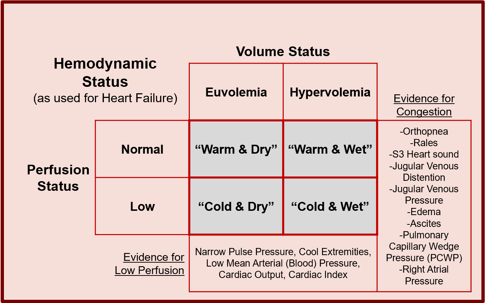

### **Case**

In this section, the implementation guide covers:

*   Overview of the Case
*   Case Features
    *   Case Features from Clinician Assessments
        *   Separation of Form Logic from patient Descriptive and Clinical Decision Logic
    *   Derived or Inferred Case Features
        *   Separating Patient Descriptive Logic from Clinical Decision Logic
*   Case Feature Groups
*   Case Feature Relationships
*   Case Summary

The data that expresses a Case consists of patient descriptors including: clinical presentation and progression, physical exam findings, diagnostic evaluations, physiological and pathophysiological assessments, past and current diagnoses, exposures, genetic markers and family history, risk and severity scores, response to treatment, and end and intermediate outcomes.  The Case, through its Case Features, is the comprehensive, detailed, and contextually relevant information about the patient with respect to a the full scope of the guideline and its recommendations using clinically meaningful descriptions of individual patient’s current and historical state of health, disease, treatment, and risks.

Examples of types of Case Features from the healthcare domain perspective:

*   Exposures (e.g., environmental or behavioral, past and current medications and procedures)
*   Physiological and pathophysiological assessments and descriptions (e.g., labs, vitals)
*   Clinical presentation and progression (e.g., signs, symptoms)
*   Diagnostic evaluations (e.g. imaging, tests) and physical exam findings
*   Family history and genetic markers
*   Past and current diagnoses
*   Risk and severity scores
*   End and intermediate outcomes
*   Response to treatment.  

Furthermore, relevant data elements may be inferred from primitive data elements (e.g., Body Mass Index (BMI), estimated Glomerular Filtration Rate (eGFR), Seattle Heart Failure Model) or may require clinical assessment and judgment using primitive data elements (e.g., Model For End-Stage Liver Disease (MELD) Score, New York Heart Association Heart Failure (NYHA HF) Class).  Medication (and other substance administrations) and procedures are considered exposures and Requests or orders without corresponding Events may be considered sufficient descriptions of the patient’s past and current interventions as well as state of health and disease, and thus part of the Case.

In the FHIR CPG, these descriptors of the patient, in the context of a Case, are modeled and referred to as CPG_CaseFeatures, whether they are primitive clinical data elements (largely Clinical, Diagnostics, and Medications resources), or inferred data elements from various expressions referenced by CPGCaseFeatures to be resolved at execution-time. If such CPGCaseFeatures cannot be resolved, then a request for end-user assessment must be initiated using an Adaptive form as described in detail below.

FIG. 72.  The Case consists of all the patient descriptors including exposures physiological and pathophysiological assessments and descriptions, clinical presentation and progression, diagnostic evaluations and physical findings, past and current diagnoses and procedures, related risk and severity scores, and family history and genetic profile.

FIG. 73.  The Case consists of facts or information about the patient called Case Features (CPGCaseFeatures) that may be resolved by [FHIR Events](https://www.hl7.org/fhir/event.html) and FHIR [Requests](https://www.hl7.org/fhir/request.html) as required data elements or inferrered (in part using required data elements).

**Case Features**

The features of the case are the clinically meaningful and relevant data elements or information that describe the current and relevant past state of the patient that is pertinent to the scope of the guideline recommendations and related decisions to be considered.  These typically describe the clinicopathophysiology pertaining to the condition(s) and state of disease, potential intervention(s), and contraindications  related to guideline recommendations.  These may include patient presentation (e.g., symptoms), clinical assessments and observations (e.g., physical findings, labs, vitals, diagnostic results, -omic profiles), diagnoses (e.g., problems or conditions) including temporally related risk and severity scores, exposures (e.g., various current and prior interventions such as medications/substances and procedures), family and travel history, as well as goals and preferences that may be relevant to the scope of the guideline and information needs for related clinical decision making and care processes.  Furthermore, case features that correlate to complications of the known or suspected disease(s) as well as suspected or potential side effects of the various interventions scoped to the guideline should be considered.  Lastly, current and prior orders and prescriptions may be considered as case features since they convey timing and intent of interventions and may be the initial or only signal thereof.

Almost all primitive key features come from a subset of the FHIR Resources and follow the event pattern.  The information from an event pattern ([FHIR Event pattern](https://www.hl7.org/fhir/event.html#mappings)) describes an activity that has taken place or that is currently taking place.

Case features in the CPG-IG are formalized and concretized as CPGCaseFeatures that reference and/or profile numerous FHIR Resources from the healthcare process domain (e.g., [Clinical](http://hl7.org/fhir/clinicalsummary-module.html), [Diagnostics](http://hl7.org/fhir/diagnostics-module.html), [Medications](http://hl7.org/fhir/medications-module.html)). The CPGCaseFeature definitions and expressions are often scoped to the overall CPGPathway and organized as their own, specialized library as they are some of the most reused components across various CPG assets and their expressions.  However, as many CPGCaseFeatures may be used across multiple CPG’s, these expressions and/or the assets containing them may be resolved by reference to a common, shared, and well-controlled library of components (e.g., a knowledge base or “registry” of features).

**Case Features from Clinician Assessments**

Many case features may require clinical judgment and/or assessment (including impression) and therefore require real-time extraction or interaction with the clinician user.  Such case features often necessitate clinician prompting and/or documentation requirements to resolve and thus may be modeled as their own ECA Rules (as part of the triggering, decision, or orchestration logic within individual CPGRecommendations, CPGStrategies, and/or the CPGPathway) or as adaptive forms (see [Adaptive Questionnaire](http://hl7.org/fhir/uv/sdc/2019May/adaptive.html)) scoped to the guideline element where they are used.  Scoping of such required information must be done carefully as to consider all guideline triggering, decision, and orchestration logic that may depend on such information.  

**Separation of Form Logic from Patient Descriptive Logic and Clinical Decision Logic**

The knowledge engineer must be careful not to conflate descriptive or evaluation logic (expressions for Case Features) or clinical decision logic (expressions in Recommendations) with formal logic for how to interact with the end-user to obtain such information (form logic) as described in the section on Tiers of Functionality <!-- link to - 07 !-->.  All clinical description logic expressions about the patient must be scoped to Case Features, all decision logic expressions must be scoped to Recommendations, and then they may be used by the adaptive questionnaire.  See section below on Separating Patient Descriptive Logic from Clinical Decision Logic.

**Derived or Inferred Case Features**

Many case features must be derived <!-- asserted = primitieve !--> or inferred computationally from other data elements (i.e., case features) such as medical calculations (e.g., BMI, eGFR, Anion Gap, hours since intervention, post-op hemoglobin drop), risk and severity scores (MELD Score, Seattle Heart Failure Model, CHA2DS2-VASc score), and case features requiring contextualization (e.g., pre-op hemoglobin, discharge weight, admission oxygen saturation, most recent blood pressure).  In the CPG implementation guide, these are referred to as derived or inferred CPGCaseFeatures and their definitions and inferencing logic expressions are typically contained within the same library as the rest of the CPGCaseFeatures scoped to the specific CPG (i.e., guideline).  Of note, there is often a “chaining” of inference where many derived case features (inferred CPGCaseFeatures) are actually dependent on other derived or inferred Case Features.   For the knowledge engineer as well as for resolvability (i.e., computability), it is important to have a means to denote, retain, and trace these dependencies- ideally in both the expressions as well as in the data provenance.

Some case features are descriptions of physiological and/or pathophysiological states of the patient that may need to be inferred from primitive case features such as the various events described above and/or may require further clinician assessment depending on which data elements are available on a given patient.  For instance, there may be a number of case features (i.e., events including clinical impressions) that are required to assess a key physiological and/or clinicopathological process and other forms of clinician assessment respective to guideline recommendations. An example of this is volume status, perfusion status, and hemodynamic status for various guideline recommendations for inpatient chronic congestive heart failure shown in the figure below.  

FIG. 74 This figure illustrates Hemodynamic Status used to assess and plan treatment for Heart Failure.  Hemodynamic Status is determined using Volume Status and Perfusion Status (each a separate, but related to the pump function of the heart) as shown above.  Some basic calculations using vital signs can be used for a simple assessment of Perfusion Status, though invasive heart monitoring is a more exact measurement.  However, while some some signs and symptoms can inform a clinician’s assessment of a patient’s Volume Status, unless invasive heart monitoring values (e.g., PCWP) are available, it can not be inferred reliably using computable expressions and thus requires an assessment (e.g., a Clinical Impression via an Adaptive form) while providing the clinician supporting information as described below.

It is not uncommon for inferred case features and events to be used to provide a decision aid to a clinician who then assesses this information and documents their clinical impression (i.e., FHIR Resource ClinicalImpression) recorded as an event and CPGCaseFeature itself.  In fact, this is the case in the example above where the clinician makes the ultimate assessment of these critical clinicopathophysiological processes that inform key decision-making in the clinical care scoped to such a CPG.  This pattern combining primitive clinical information (i.e., events), inferences made upon them (i.e., inferred case features), and requests for clinician documentation manifested as a clinical impression often addressed using an Adaptive Form (see [FHIR Adaptive form](http://hl7.org/fhir/uv/sdc/2019May/adaptive.html),  the FHIR Questionnaire,  and QuestionnaireResponse Resources).  These patterns are commonly used as part of the CPG.

**Separating Patient Descriptive Logic from Clinical Decision Logic**

An important note to the knowledge engineer to pay special attention to the separation of decision logic about what to do for the patient from description or inferencing logic that describes something about or the nature of the patient (e.g. clinical pathological process, risk, severity, in qualifiers thereof).  This greatly simplifies the decision logic as well as makes the inferences about the patient readily available for other logic and/or other use cases.  This takes particular attention from the knowledge engineer to disambiguate the logic that evaluates the state and/or condition of the patient (or qualifiers thereof) from the logic that describes how a clinician reasons over what to do for the patient.  

Several questions the knowledge engineer may ask themselves are: “describe something about the patient?”, “does this qualify the patient’s historical, present, or likely future clinical state or status?”, and “does this decision logic focus on solely evaluating descriptive patient-level variables (as CPGCaseFeatures) and describing what to do or not to do for the patient given these conditions?”

**Case Feature Groups**

For numerous reasons, sets or groups of case features often need to be considered together, including to present the dependencies (i.e., set of case features) of derived case features or to denote case features that are relevant or pertinent to a given recommendation or decision (i.e., supporting information).  CPGCaseFeatureGroups are defined using the FHIR GraphDefinition Resource and realized as a FHIR Composition Resource.  Furthermore, a case feature group may have a particular semantic relevance within the guideline such as a case feature or recommendation and may use the ?scoping_relationship of the CPGCaseFeatureGroup profile to denote so.

**Case Feature Relationships**

Many case features have special meaning when taken in the context of other case features and/or other CPG semantics (e.g., recommendations).  This contextual meaning may be conveyed through a semantic relationship between the case feature and its contextualizing semantic (i.e., another case feature(s) or recommendation(s)).  The CPGCaseFeature profile addresses this through an attribute that includes both the reference to the other semantic(s) and the explicit nature of the relationship (i.e., coded value).  As described above, certain case features have particular relevance in the context of some medical decision-making process or recommendation that is known in the healthcare domain as pertinence.  In the CPG-IG, pertinence is an additional optional qualifier on a given CPGCaseFeatureRelationship.  Pertinence may be positive or negative, strong or weak, and/or pathognomonic.  Furthermore, pertinence may be static or inferred through an expression.

**Case Summary**

A summary of all the case features can provide a collection of all the clinically meaningful data elements, both primitive and inferred, pertaining to the full scope of a given CPG.  The CPGCaseSummary affords this collection and is a specialization of a CPGCaseFeatureGroup. It may be composed by referencing one or more CPGCaseFeatureGroups and one or more CPGCaseFeatures.
