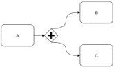
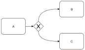
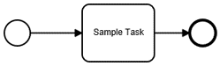

# Methodology

Within the overall framework of knowledge engineering described in the [approach](approach.md) page,
this implementation guide describes a methodology for moving between the knowledge levels. Note that this
methodology emphasizes that the knowledge levels are a continuum of knowledge representation, they are
not intended to be rigidly interpreted discrete categories, rather they serve as a framework for
discussing successively more structured and formal representations of knowledge content to aid in
the understanding, communication, and implementation of guideline content.

## Knowledge Elicitation

## Knowledge Representation Formalisms

In addition to the FHIR-based L3 representation formalisms that are the focus of this implementation guide,
the BPM+ family of knowledge representation standards from Object Modeling Group (OMG) are being used to
represent clinical guideline and pathway content. This section describes potential approaches for using
the BPM+ standards in coordination with this implementation guide. Readers of this section are expected to
have some level of familiarity with the BPM+ standards, specifically BPMN, CMMN, and DMN.

Within the overall framework of levels of knowledge, the visual representation aspects of the BPM+ family of
standards fit within L2, diagrams, workflows, and process models, while the executable aspects of these
standards range into L3 and even L4, given systems that are capable of executing BPMN, CMMN, and DMN content.

TODO: Diagram depicting placement of BPMN, CMMN, DMN along-side the FHIR-based specifications

In particular, this implementation guide defines 3 layers of process-modeling structures:

1. Pathway - BPMN/CMMN (Leaning towards BPMN)
2. Strategy - BPMN/CMMN (Leaning towards CMMN)
3. Recommendation - BPMN/DMN (Leaning towards DMN)

Of course, this correspondence is a rough equivalence, there are aspects of process- and decision-modeling throughout
each of the layers, but this provides a starting point for approaching integrated use of these standards.

## Transformation

Focusing on process semantics, this section provides mappings between BPMN and PlanDefinition, informed by the
[workflow patterns](http://workflowpatterns.com/) work done at the Eindhoven University of Technology and Queensland
University of Technology, and applied to FHIR by a joint project between the University of Applied Sciences Upper Austria ("FH Hagenberg") and CGM Clincal Austria for a prototype for medical boards (project "KIMBo").

The definition of a Process is specified using either BPMN or a FHIR PlanDefinition, then the Atlas Transformation Language (ATL)
can be used to transform between the two, using the [Control Flow and Data Flow patterns](http://workflowpatterns.com/evaluations/standard/) as a metamodel. The following sections consider specific patterns and the BPMN and PlanDefinition representations of each.

### Sequence Flow

  

**Definition**
A sequence flow is a directed arc from one source node to exactly one target node.

| BPMN | Start-Event, End-Event, Sequence |
| PlanDefinition | PlanDefinition.relatedAction Before-Start |

**BPMN Representation**


**PlanDefinition Representation**


### Parallel Split

  

**Definition**
A parallel split is separating the sequence flow in parallel branches that are executed concurrently.

| BPMN | ParallelGateway |
| PlanDefinition | PlanDefinition.groupingBehavior, PlanDefinition.selectionBehavior |

**Remarks**
A merge element is created implicitly

**BPMN Representation**


**PlanDefinition Representation**


### Exclusive Choice

  

**Definition**
An exclusive choice is an element where the sequence flow
is split into two or more branches, whereas only one of the branches
can be activated with respect to a specified condition on the exclusive choice element.

| BPMN | EclusiveGateway, ExtensionElement, TaskListener |
| PlanDefinition | PlanDefinition.groupingBehavior, PlanDefinition.selectionBehavior |

**Remarks**
A synchronization element is created implicitly

**BPMN Representation**


**PlanDefinition Representation**


### Timed Start Event

  

**Definition**
A TimedStartEvent is a special StartEvent that has a TimerEvent associated with it, which defines when the process has to be executed.

| BPMN | Start-Event, End-Event, Sequence |
| PlanDefinition | PlanDefinition.relatedAction Before-Start

**Remarks**
As PlanDefinition does not offer a specific action for either start or end, these BPMN-Elements are to be created implicitly. Whilst the start Event is based on the Elements in the first action in the list of actions in the PlanDefinition

**BPMN Representation**


**PlanDefinition Representation**

