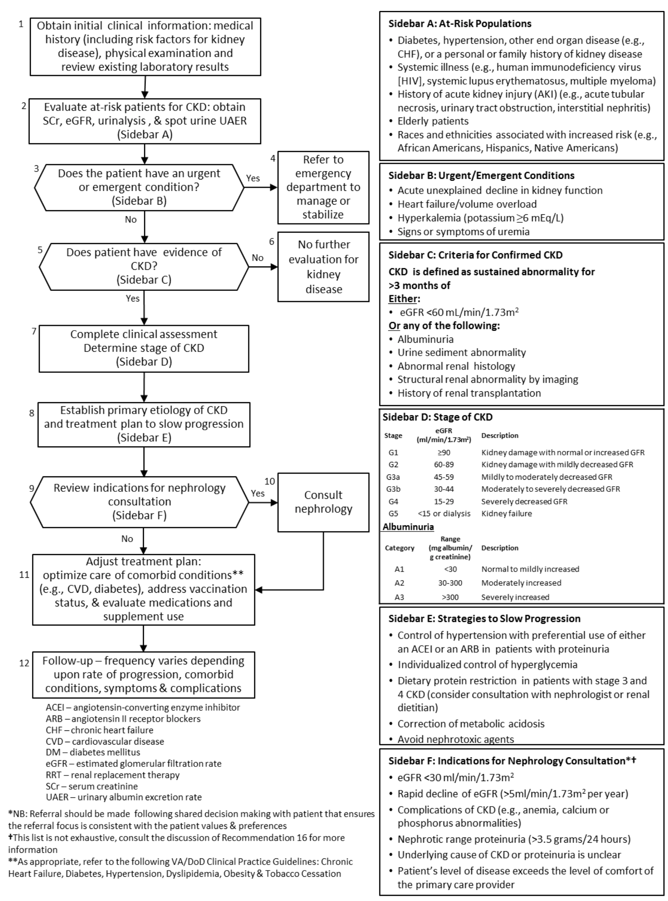

# Chronic Disease Management - Chronic Kidney Disease (CKD)

* [Overview](#overview)
* [Chronic Kidney Disease (CKD) Guidelines](#chronic-kidney-disease-ckd-guidelines)
  * [KDIGO](#kdigo-international-guideline)
  * [VA/DoD](#vadod-clinical-practice-guideline-for-ckd)
* [Guideline Order Sets](#guideline-order-sets)
* [Guideline Recommendations](#guideline-recommendations)
* [Example FHIR Resources](#example-fhir-resources)

## Overview
The system-wide goal of evidence-based guidelines is to improve the patient’s health and well-being by guiding health providers who are taking care of patients with chronic health conditions along the management pathways that are supported by evidence and are thus considered the highest standard of care.
This example focuses on Chronic Kidney Disease, however we expect that this implementation guide will be applicable to management of many other chronic health conditions, e.g. diabetes, hypertension, congestive heart failure, etc.

The expected outcome of successful implementation of this guideline is to:
* Formulate an efficient and effective assessment of the patient's condition
* Optimize the use of therapy to reduce disease progression, reduce symptoms of CKD, and enhance patient functionality
* Minimize preventable complications and morbidity
* Emphasize the use of personalized, proactive, patient-driven care

This clinical use case example is based on the [NIH Chronic Kidney Disease (CKD) Care Plan project](https://www.niddk.nih.gov/health-information/communication-programs/nkdep/working-groups/health-information-technology/development-electronic-ckd-care-plan).
* Persona descriptions for patients with CKD and their provider care team members are available from the NIH site:
  * [Patient personas](https://www.niddk.nih.gov/-/media/Files/Health-Information/Communication-Programs/NKDEP/Patient_Personas_508.pdf?la=en); sample FHIR resources in this guide are based on Betsy Johnson's persona
  * [Provider personas](https://www.niddk.nih.gov/-/media/Files/Health-Information/Communication-Programs/NKDEP/Provider_Personas_508.pdf?la=en) for six members of a CKD patient's care team
* A draft set of data elements and terminology codes are also available for CKD care management, created by the NIH CKD Care Plan Working Group
  * [CKD Data Elements](https://www.niddk.nih.gov/health-information/communication-programs/nkdep/working-groups/health-information-technology/development-electronic-ckd-care-plan#draftSet)

## Chronic Kidney Disease (CKD) Guidelines
The guidelines described in this example follow a recommended clinical workflow for diagnosis and care management. The steps in this workflow will be harmonized with other sources to specify a common pattern recommended for all clinical practice guidelines that follow this implementation guide. The pattern includes these general steps:
1. Screen At-Risk Populations
2. Evaluate Urgent/Emergent Conditions
3. Criteria for Confirmed Diagnosis
4. Determine Stage of Disease
5. Strategies to Slow Progression
6. Criteria for Specialist Consultation

### KDIGO International Guideline
The Kidney Disease: Improving Global Outcomes (KDIGO) 2012 Clinical Practice Guideline for the
[Evaluation and Management of Chronic Kidney Disease (CKD)](https://kdigo.org/guidelines/ckd-evaluation-and-management/)

### VA/DoD Clinical Practice Guideline for CKD
[Management of Chronic Kidney Disease (CKD) in Primary Care (2014)](https://www.healthquality.va.gov/guidelines/cd/ckd/index.asp)

| CKD Guideline Algorithm |
| --- |
|  |

## Guideline Recommendations
The following CKD guideline recommendations are copied verbatim from the VA/DoD guideline and will be used to create an example implementation using FHIR and CQL. The provided examples do not yet cover these recommendations.

<table border="1" cellpadding="2">
<tr align="center"><th>Strength</th>
<th>Recommendation</th></tr>

<tr><td>Weak For</td>
<td>
We suggest that periodic evaluation for CKD be considered in patients with the following: <ul>
<li>Diabetes, hypertension, other end organ disease (e.g., chronic heart failure [CHF]), or a personal or family history of kidney disease</li>
<li>Systemic illness (e.g., human immunodeficiency virus [HIV], systemic lupus erythematosus, multiple myeloma)</li>
<li>History of acute kidney injury (AKI) (e.g., acute tubular necrosis, urinary tract obstruction, interstitial nephritis)</li>
<li>Elderly patients</li>
<li>Races and ethnicities associated with increased risk (e.g., African Americans, Hispanics, Native Americans)</li>
</ul>
</td></tr>
<tr>
<td>Weak For</td>
<td>In patients with stage 3 and 4 CKD, we suggest a protein diet of 0.6 to 0.8 g/kg/day as it may slow the decline in glomerular filtration rate (GFR) and progression to end-stage renal disease (ESRD).</td>
</tr>
<tr>
<td>Strong For</td>
<td>In adult patients with stages 1-4 CKD, we recommend that blood pressure targets should be less than 140/90 mmHg.</td>
</tr>
<tr>
<td>Strong For</td>
<td>In patients with diabetes, hypertension, and albuminuria, we recommend the use of an ACEI or ARB to slow the progression of CKD, unless there is documentation of intolerance.</td>
</tr>
<tr>
<td>Strong For</td>
<td>We recommend that all patients with CKD who are not on dialysis and have no known history of coronary artery disease be assessed for 10-year CVD risk using a validated risk calculator for primary prevention. If at risk (as defined in the VA/DoD Management of Dyslipidemia guideline), we recommend use of at least a low dose statin.</td>
</tr>
<tr>
<td>Weak For</td>
<td>We suggest offering supplemental vitamin D to correct vitamin D deficiency in patients with CKD stages 3 or 4.</td>
</tr>
<tr>
<td>Weak Against</td>
<td>We suggest not offering phosphate binders to patients with stage 3 and 4 CKD with normal serum phosphorous.</td>
</tr>
</table>

## Guidance at the Point of Care

The provision of care for chronic health conditions typically includes guidance delivered in two ways:
* Alerts presented to a clinician at the point of care, e.g. when the calculated kidney failure risk exceeds a threshold.
 * Delivered using CDS Hooks embedded within the EHR system workflow.
* A new patient-specific care plan is created with interventions (order sets) determined by guideline recommendations.
 * Delivered as a FHIR CarePlan resource with associated activities, including MedicationRequest, ServiceRequest, and Appointment resources. May include a new or revised FHIR CareTeam resource specifying participants and their roles.

The included FHIR and CQL examples illustrate both of these use cases.

### Care Plan Order Sets
Order sets from CKD practice guidelines are categorized for presentation to clinicians and/or when creating and executing order sets that require different order management processes. The provided examples include the following order set categories:
* Laboratory orders
  * Blood chemistry
  * Urine analysis
* Medications
* Procedures to be performed
  * e.g. renal ultrasound
* Patient self-care, to be performed by patient at home
  * e.g. weight, blood pressure, exercise, food diary

Example FHIR resources
* PlanDefinition - cc-cpg-plan-ckd
* ActivityDefinition - cc-cpg-activity-edu-hypertension, cc-cpg-activity-lab-metabolic, cc-cpg-activity-ultrasound-renal, cc-cpg-activity-referral-dietition

### Decision Support Alerts: CKD Risk Assessment
This example is configured for deployment into the cqf-ruler server for deployment using CDS-Hooks.

Example FHIR resources
* CQL - ckd-risk-logic.cql
* Library - library-ckd-recommendations
* PlanDefinition - plandefinition-ckd-risk-screening
* ActivityDefinition - activitydefinition-ckd-referral-nephrology (conditional, based on risk)
